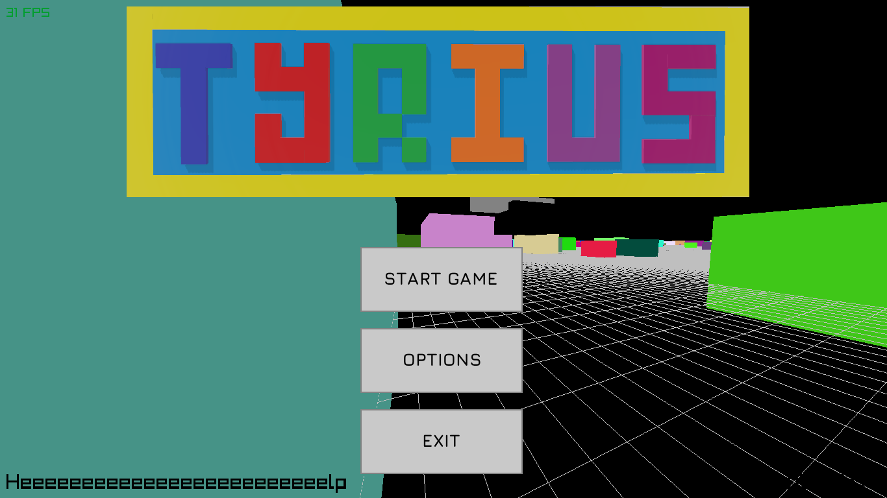
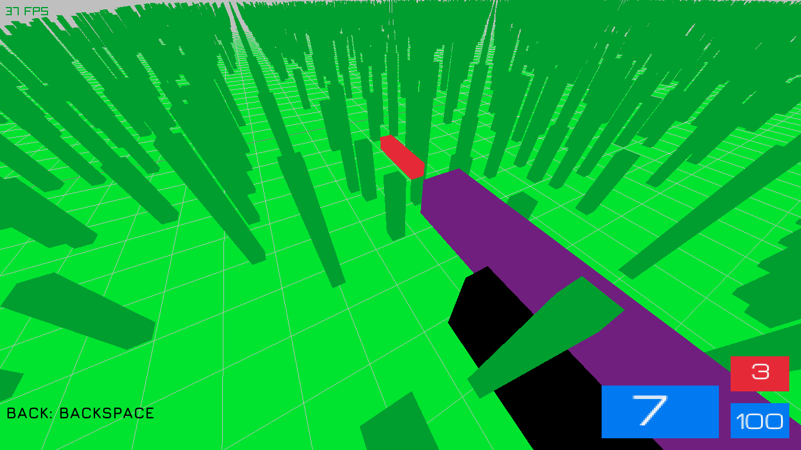
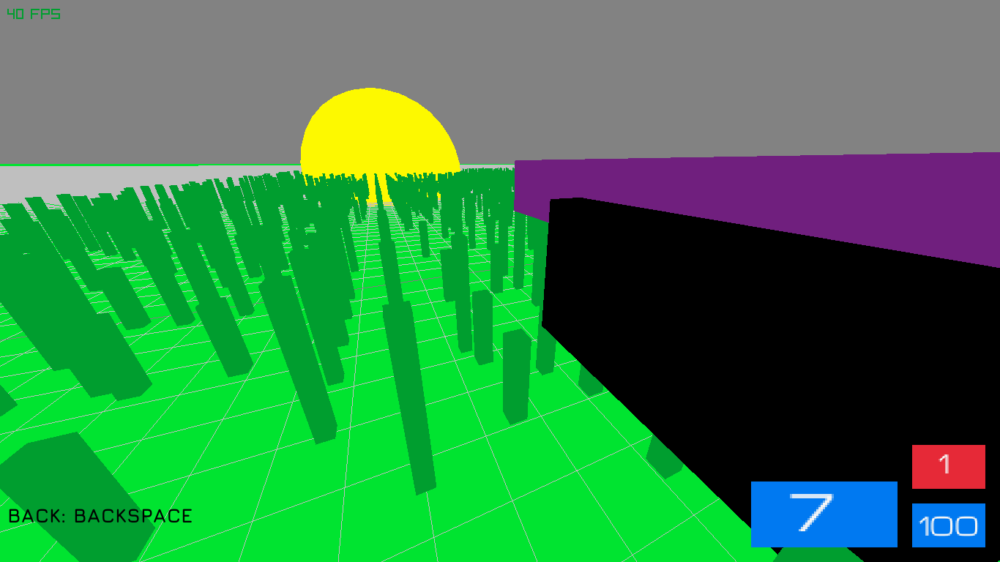
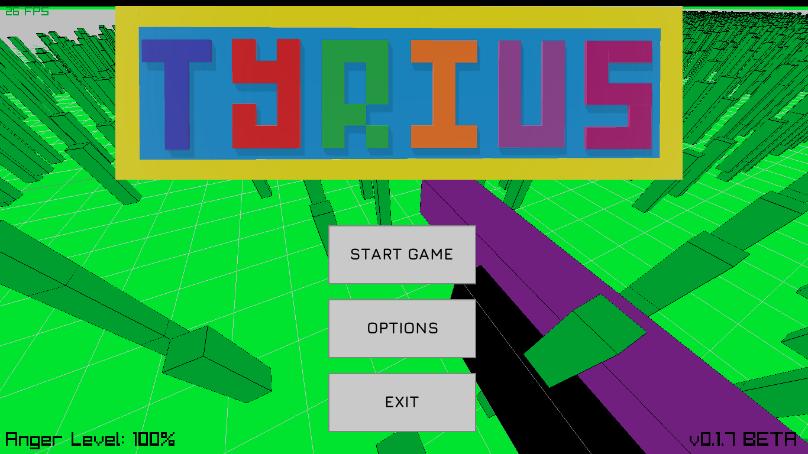
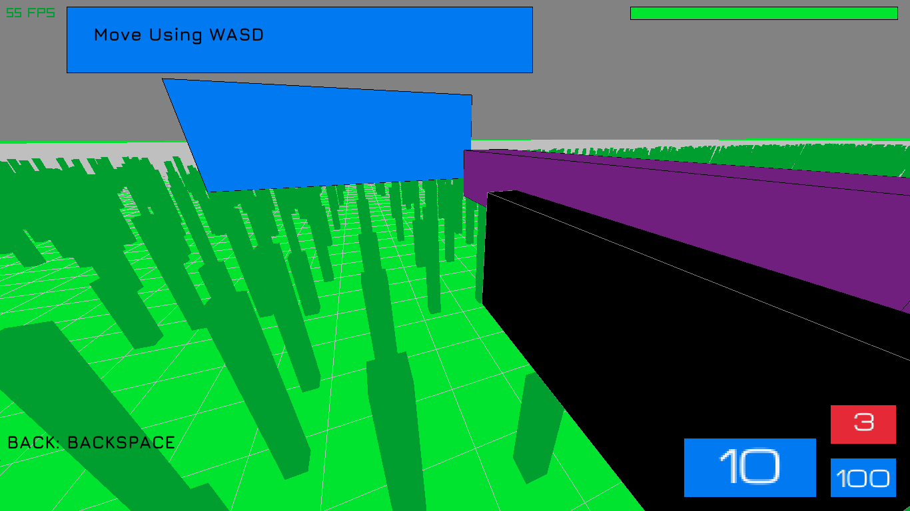
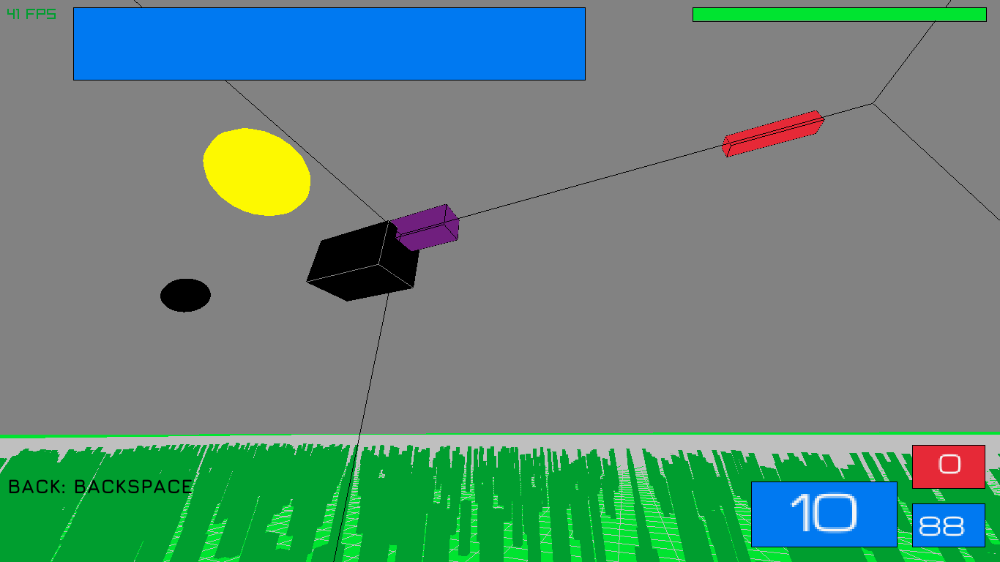

# Tyrius
My experiment of creating 3D FPS game in C with [raylib](http://www.raylib.com),Still prototype but playable

## Current available scenes
1. Splashscreen
1. Menu
3. Tutorial
4. Freemode (A mode where you do things freely like moving and shooting)

## Current controls
1. WASD to move player
2. Left mouse button to shoot
3. Right mouse button to throw grenade
4. Middle mouse button to draw aim laser
5. Q key to enable armor
6. R key to reload
7. Backspace key to go back in scenes
8. 0 number key to take screenshot (Saved in `screenshots` folder)
9. Move mouse to rotate view (First person mode camera)

## Problems
Cause Tyrius is in prototype mode,The game has some problems unfortunately like:

1. Camera orbiting the gun,bullet,And bomb,Which is reason why i didn't completed the game.
2. Some game scenes missing (Game levels,Options)
3. No game maps or physics

> Please if you can help me and fix camera orbiting problem i would be thanful cause i still think about completing this game rather than the rhythm game i'm working on.

## Credits
1. Rabia Alhaffar (Main programmer)

> For third party content used see `LICENSES.txt`